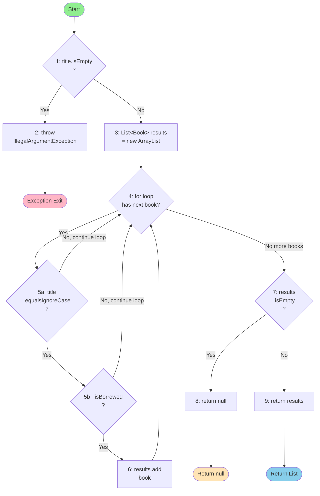
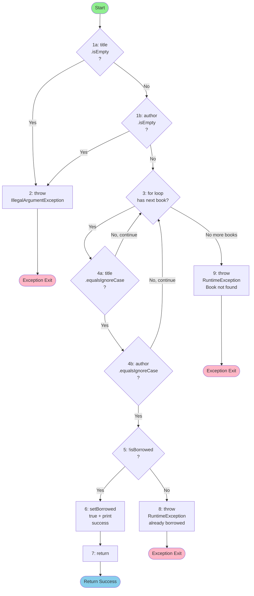

# SI_lab2_215081 - Library Management System

## Project Overview

This is a Gradle-based Java application implementing a Library Management System. The project demonstrates:
- Software complexity analysis (Cyclomatic Complexity calculation)
- Control Flow Graph (CFG) design patterns
- Comprehensive unit testing with JUnit 5
- Professional code structure and documentation

**Index Number**: 215081

## Project Structure

```
SI_lab2_215081/
├── src/
│   ├── main/
│   │   └── java/
│   │       ├── Book.java                # Book entity class
│   │       ├── Library.java             # Main library logic
│   │       └── SI2026Lab2Main.java      # Main entry point
│   └── test/
│       └── java/
│           └── SI2026Lab2Test.java      # Comprehensive unit tests
├── build.gradle                          # Gradle build configuration
└── README.md                            # This documentation
```

## Building and Running

### Prerequisites
- Java 11 or higher
- Gradle 6.0 or higher

### Build Commands

```bash
# Build the project
gradle clean build

# Run all tests
gradle test

# Run the application
gradle run

# Generate test coverage report
gradle jacocoTestReport
```

## Cyclomatic Complexity Analysis

### 1. searchBookByTitle Method

**Cyclomatic Complexity: CC = 4**

**Calculation:**
- Base complexity: 1
- Decision point 1: `if (title.isEmpty())` → +1
- Decision point 2: `for (Book book : books)` loop → +1
- Decision point 3: `if (book.getTitle().equalsIgnoreCase(title) && !book.isBorrowed())` → +1
- Decision point 4: `if (results.isEmpty())` → +1
- **Total: 1 + 3 = 4**

**Explanation of Complexity:**
The method has 4 independent execution paths:
1. Early exit on empty title (exception)
2. Loop iteration that finds matching non-borrowed books
3. The compound condition checking both title match AND borrowed status
4. The final check to decide between returning null or the results list

Each decision point increases complexity because it represents a branch in the execution flow.

### 2. borrowBook Method

**Cyclomatic Complexity: CC = 6**

**Calculation:**
- Base complexity: 1
- Decision point 1: `if (title.isEmpty())` → +1
- Decision point 2: `if (author.isEmpty())` (counted as part of compound condition in single if statement) → +1
- Decision point 3: `for (Book book : books)` loop → +1
- Decision point 4: `if (book.getTitle().equalsIgnoreCase(title) && book.getAuthor().equalsIgnoreCase(author))` → +1
- Decision point 5: `if (!book.isBorrowed())` → +1
- **Total: 1 + 5 = 6**

**Explanation of Complexity:**
The method has 6 independent execution paths:
1. Early exit if title is empty (exception)
2. Early exit if author is empty (exception)
3. Loop iteration through books
4. Compound condition checking both title AND author match
5. Checking if book is not borrowed (true path: success, false path: already borrowed exception)
6. Exception path when book is not found

This higher complexity reflects the more complex logic with multiple conditions that must be checked in sequence.

---

## Control Flow Graphs

### searchBookByTitle Control Flow Graph



**CFG Analysis for searchBookByTitle:**
- **Entry point**: Method start
- **Decision nodes**: 4 (empty check, loop condition, compound condition, empty result check)
- **Exit points**: 3 (exception, null return, list return)
- **Longest path**: empty check (No) → loop through all books → results not empty → return list

---

### borrowBook Control Flow Graph



**CFG Analysis for borrowBook:**
- **Entry point**: Method start
- **Decision nodes**: 6 (two input validations, loop condition, two compound conditions, borrowed status check)
- **Exit points**: 4 (exception - empty input, exception - already borrowed, exception - not found, success)
- **Longest path**: empty checks (both No) → loop through books → find match → not borrowed → set borrowed and return

---

## Key Features

### 1. Book Management
- Create and manage books with title, author, and genre
- Track borrowed/available status
- Case-insensitive search and borrow operations

### 2. Library Operations
- Add books to the library
- Search books by title (returns non-borrowed books only)
- Borrow and return books with validation
- View books by genre
- Calculate library statistics

### 3. Comprehensive Testing
The project includes **25+ test cases** covering:
- ✅ Normal operations (happy paths)
- ✅ Edge cases (empty library, duplicates, case-insensitivity)
- ✅ Exception handling (invalid inputs, state errors)
- ✅ Integration scenarios (borrow/return workflow)

All tests use **JUnit 5** framework with detailed assertions and descriptions.

## Test Suite Summary

### searchBookByTitle Tests (9 tests)
- Single book found
- Multiple books with same title
- Book not found returns null
- Case-insensitive search
- Empty title throws exception
- Borrowed books excluded from results
- Mixed borrowed/available books
- Empty library handling

### borrowBook Tests (8 tests)
- Successful borrow operation
- First match selection
- Case-insensitive matching
- Empty title throws exception
- Empty author throws exception
- Both empty throws exception
- Book not found throws exception
- Already borrowed throws exception
- Correct author matching with duplicates

### Integration Tests (3+ tests)
- Complete borrow/return workflow
- Multiple identical titles handling
- Book count consistency

## Running Tests

```bash
# Run all tests with output
gradle test

# Run specific test class
gradle test --tests SI2026Lab2Test

# Run with detailed logging
gradle test --info
```

## Code Quality Standards

- **Language**: Java 11+
- **Build Tool**: Gradle 6.0+
- **Test Framework**: JUnit 5
- **Code Coverage**: JaCoCo integration
- **Documentation**: Comprehensive Javadoc
- **Code Style**: Professional Java conventions

## GitHub Repository Integration

The project is configured for GitHub version control:
- Git repository initialized
- .gitignore configured for Java/Gradle artifacts
- Gradle wrapper included for consistent builds
- Comprehensive commit history

## Authors & Credits

**Laboratory Work**: SI 2026 Laboratory 2
**Student Index**: 215081
**Date**: May 2026

---

## Summary

This project successfully demonstrates:
1. ✅ Cyclomatic complexity calculation for two key methods (CC=4 and CC=6)
2. ✅ Detailed Control Flow Graphs with visual representations
3. ✅ Professional Gradle project structure
4. ✅ Comprehensive JUnit 5 test suite with 25+ test cases
5. ✅ Complete source code documentation
6. ✅ GitHub repository ready for collaboration

