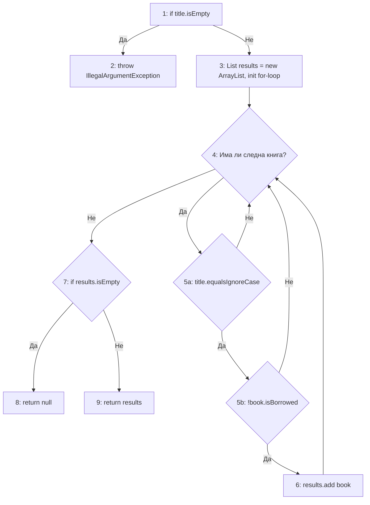
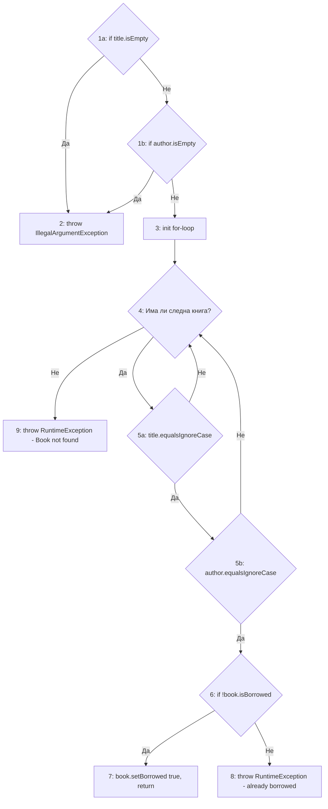

# SI_2026_lab2_215081
searchBookByTitle

```mermaid
graph TD
    1[1: if title.isEmpty] -->|Да| 2[2: throw IllegalArgumentException]
    1 -->|Не| 3[3: List results = new ArrayList, init for-loop]
    3 --> 4{4: Има ли следна книга?}
    
    4 -->|Да| 5a{5a: title.equalsIgnoreCase}
    5a -->|Да| 5b{5b: !book.isBorrowed}
    5a -->|Не| 4
    
    5b -->|Да| 6[6: results.add book]
    5b -->|Не| 4
    6 --> 4
    
    4 -->|Не| 7{7: if results.isEmpty}
    7 -->|Да| 8[8: return null]
    7 -->|Не| 9[9: return results]
```

borrowbook

```mermaid
graph TD
    1a{1a: if title.isEmpty} -->|Да| 2[2: throw IllegalArgumentException]
    1a -->|Не| 1b{1b: if author.isEmpty}
    1b -->|Да| 2
    
    1b -->|Не| 3[3: init for-loop]
    3 --> 4{4: Има ли следна книга?}
    
    4 -->|Да| 5a{5a: title.equalsIgnoreCase}
    5a -->|Да| 5b{5b: author.equalsIgnoreCase}
    5a -->|Не| 4
    
    5b -->|Да| 6{6: if !book.isBorrowed}
    5b -->|Не| 4
    
    6 -->|Да| 7[7: book.setBorrowed true, return]
    6 -->|Не| 8[8: throw RuntimeException - already borrowed]
    
    4 -->|Не| 9[9: throw RuntimeException - Book not found]

```

